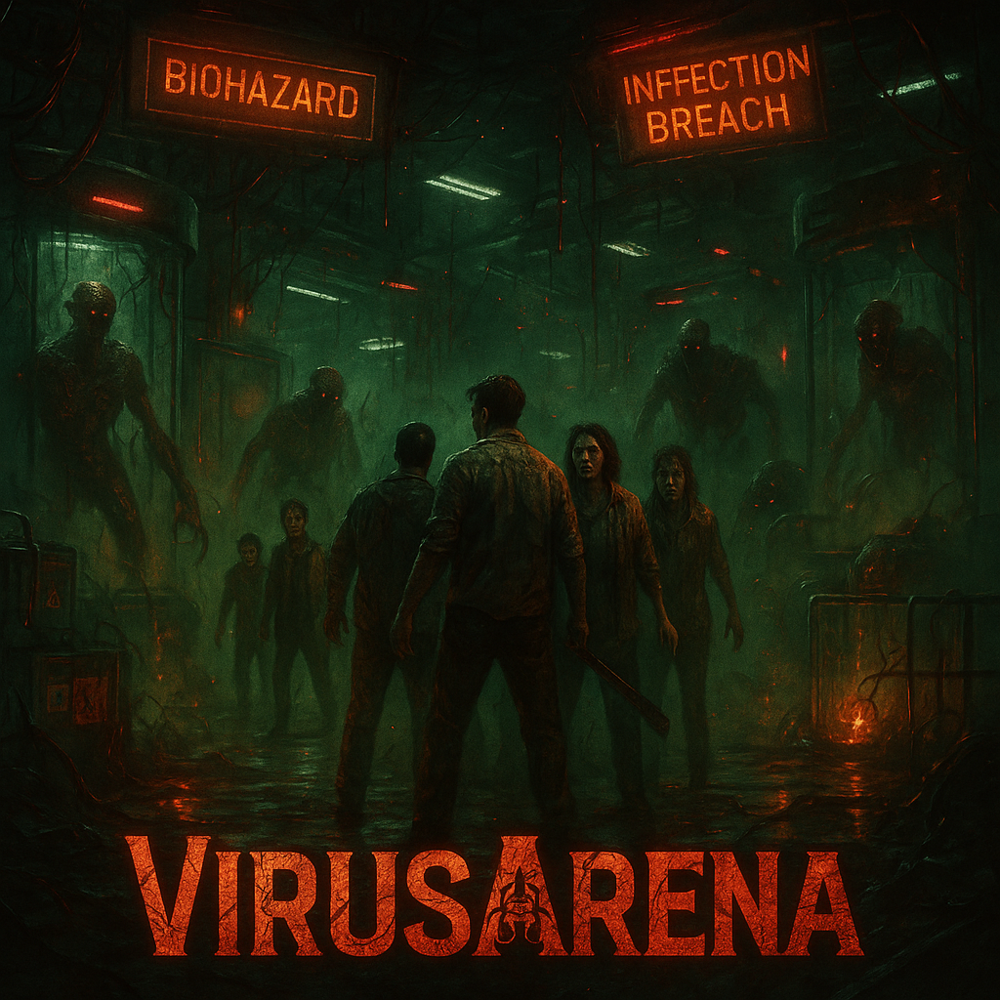
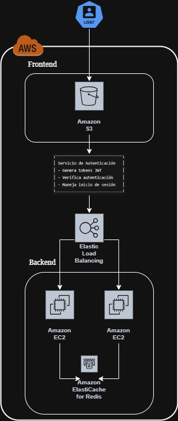

# 🏰 VirusArena Backend

**VirusArena Backend** is the core multiplayer game server that handles game logic, user authentication, and real-time communication using WebSockets.

<p align="center">
  
</p>

---

## 🌟 Features

- 🔒 **Secure Authentication** with JWT and Spring Security
- ⚡ **Real-time Communication** via STOMP over WebSockets
- 🎮 **Match Management** with advanced game logic
- 🗄️ **Data Persistence** using MariaDB and Flyway
- 📈 **Scalability** designed for multiple EC2 instances
- 📊 **Monitoring** enabled with Spring Boot Actuator

---

## 🎯 Quality Attributes Implementation

### 🔒 Security
1. **Authentication**
   - Implemented JWT token-based authentication system  
   - Secure password storage using BCrypt encryption  
   - Token validation and expiration handling  
   - **Scenario 1**: When a user attempts to log in with invalid credentials, the system rejects the request and returns a 401 Unauthorized response, preventing brute force attacks.  
   - **Scenario 2**: JWT tokens expire after 1 hour of inactivity, forcing re-authentication and reducing the window for token hijacking.

2. **Authorization**
   - Role-based access control (`ROLE_HOST` and `ROLE_USER`)  
   - Protected endpoints using Spring Security  
   - Secure WebSocket communication with token validation  
   - **Scenario 1**: Only players with the `ROLE_HOST` can start the game, verified through JWT claims in the `/lobby/{gameCode}/start` endpoint.  
   - **Scenario 2**: WebSocket connections require valid JWT tokens in the headers, preventing unauthorized users from joining game sessions.

---

### ⚡ Availability
1. **Horizontal Scaling**
   - Deployed on 2+ EC2 instances for high availability  
   - Stateless architecture for easy scaling  
   - **Scenario 1**: With up to 8 players connected simultaneously, the system maintains an average response time under 300ms by distributing the load across 2 EC2 instances.  
   - **Scenario 2**: If one instance fails, the load balancer (ELB) automatically reroutes requests to the healthy instance, ensuring uninterrupted service.

2. **Load Balancing**
   - Configured AWS Elastic Load Balancer (ELB)  
   - Traffic distribution across backend instances  
   - **Scenario 1**: The ELB evenly distributes WebSocket connections between active instances, keeping CPU usage below 50%.  
   - **Scenario 2**: New game sessions are routed to the instance with fewer active connections, reducing initial lobby latency.

3. **Caching**
   - Implemented Redis caching layer for performance  
   - Reduced database load for frequent operations  
   - **Scenario 1**: Player profiles are temporarily cached in Redis, decreasing database query load during frequent lobby updates.  
   - **Scenario 2**: The game state is cached every 5 seconds, allowing players to reconnect without losing progress in the event of brief disconnections.

---

### 🛠️ Maintainability
1. **Code Quality**
   - Integrated SonarCloud for static code analysis  
   - Achieved "A" rating for both frontend and backend  
   - Over 40% unit test coverage  
   - **Scenario 1**: SonarCloud analysis flags and blocks pull requests with code smells, maintaining a technical debt ratio below 3%.  
   - **Scenario 2**: Unit tests cover 45% of critical paths, including JWT validation and game state transitions.

2. **CI/CD Pipeline**
   - Automated code quality checks  
   - Continuous inspection with SonarQube integration  
   - **Scenario 1**: Every commit triggers SonarQube analysis, and builds are rejected if they contain security vulnerabilities with CVSS scores greater than 7.  
   - **Scenario 2**: Automated deployment rolls back if health checks fail on the new instance within 5 minutes.

---

## 🏗️ Architecture Overview

The system is hosted on AWS with a decoupled frontend and backend. It uses load balancing and caching for optimal performance and scalability.

<p align="center">
  
</p>

## 📄 Project Diagrams

[ **Click here to view the project diagrams**](./ARSW_PROYECT_DIAGRAMS.docx)

📝 File: `ARSW_PROYECT_DIAGRAMS.docx`  

---

### Frontend
- Hosted on Amazon S3
- Uses a custom authentication service that:
  - Generates and verifies JWT tokens
  - Manages user sessions

### Backend
- Requests are routed via **Elastic Load Balancer** to multiple EC2 instances running Spring Boot
- Backend communicates with **ElastiCache for Redis** for performance
- Data is persisted in **MariaDB**
- Real-time communication enabled via WebSockets

---

## 🧩 Project Structure

```bash
VirusArena-ARSW-2025-1-Backend/
├── src/
│   ├── main/
│   │   ├── java/edu/eci/arsw/
│   │   │   ├── config/              # Config classes
│   │   │   ├── controller/          # REST & WebSocket controllers
│   │   │   ├── exception/           # Custom exceptions
│   │   │   ├── model/               # Domain models and game logic
│   │   │   ├── repository/          # JPA repositories
│   │   │   ├── security/            # JWT security
│   │   │   ├── service/             # Business logic
│   │   │   └── VirusArenaApplication.java
│   └── resources/
│       ├── db/migration/            # Flyway DB migrations
│       └── application.properties
└── pom.xml                          # Maven dependencies
```

---

## 🚀 Technologies Used

- **Spring Boot 3.2.5**
- **Spring Security**
- **Spring WebSockets**
- **JWT Authentication**
- **MariaDB**
- **Flyway** (for DB migrations)
- **Lombok**
- **STOMP Protocol**
- **Redis** (for caching)
- **SonarCloud** (for code quality)

---

## ⚙️ Installation & Setup

### Prerequisites

- Java 21 ☕
- MariaDB 10.6+ 🐬
- Maven 3.8+ 🛠️
- Redis 🧠

### Steps

1. **Clone the repository:**

```bash
git clone https://github.com/your-username/VirusArena-ARSW-2025-1-Backend.git
cd VirusArena-ARSW-2025-1-Backend
```

2. **Configure the database:**

```sql
CREATE DATABASE virusarena;
CREATE USER 'virusarena_user'@'localhost' IDENTIFIED BY 'root123';
GRANT ALL PRIVILEGES ON virusarena.* TO 'virusarena_user'@'localhost';
```

3. **Edit `application.properties`:**

Update the file `src/main/resources/application.properties` with your database and Redis credentials.

4. **Run the application:**

```bash
mvn clean install
mvn spring-boot:run
```

---

## 🌐 API Endpoints

| Method | Endpoint             | Description               |
|--------|----------------------|---------------------------|
| POST   | `/api/auth/login`    | Authenticate user         |
| POST   | `/api/auth/register` | Register a new user       |
| WS     | `/ws`                | WebSocket game connection |

---

## 🖥️ Frontend Integration

The backend is designed to work with the **VirusArena Frontend**, exposing:

- REST API for authentication
- WebSockets for real-time gameplay
- CORS configured for frontend domains

---

## 📜 License

This project is licensed under the [MIT License](./LICENSE).

---

## ✨ Authors
### **VirusArena Project – ARSW 2025**
#### Developed by DuskBorn Devs
* Manuel Suarez / [@ManuelSuarez07](https://github.com/ManuelSuarez07)
* Yeltzyn Sierra / [@YeltzynS](https://github.com/YeltzynS)
